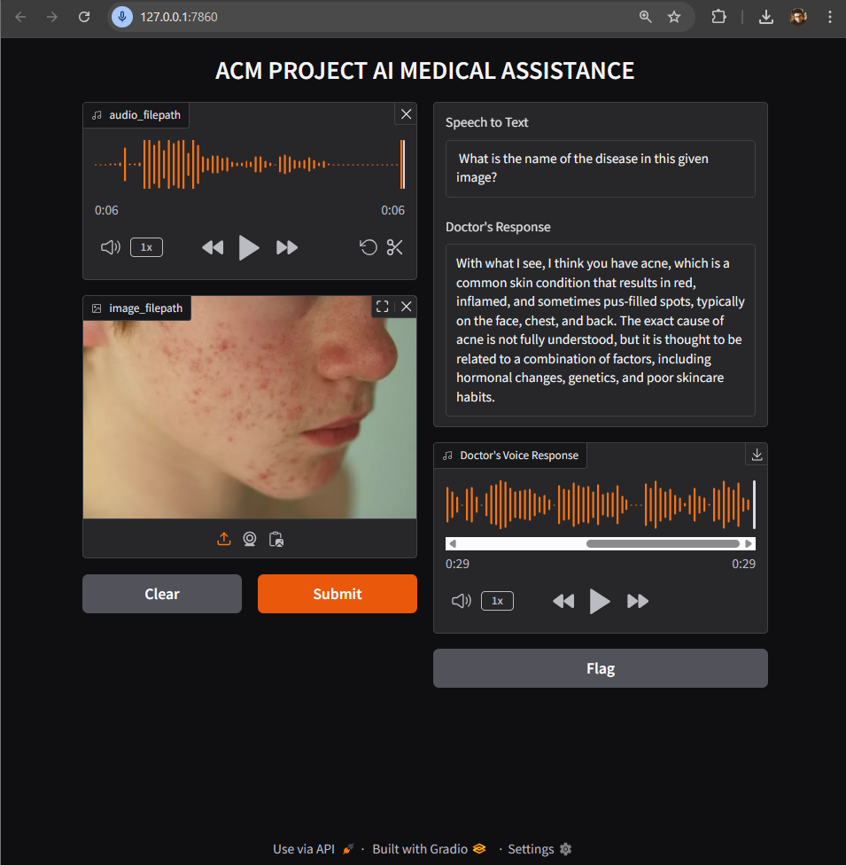
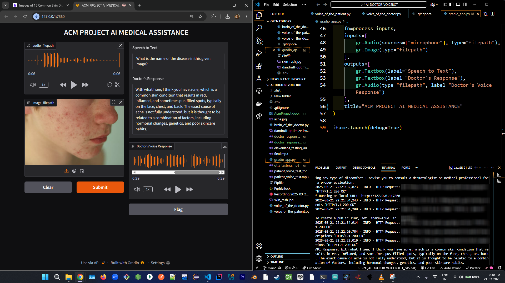
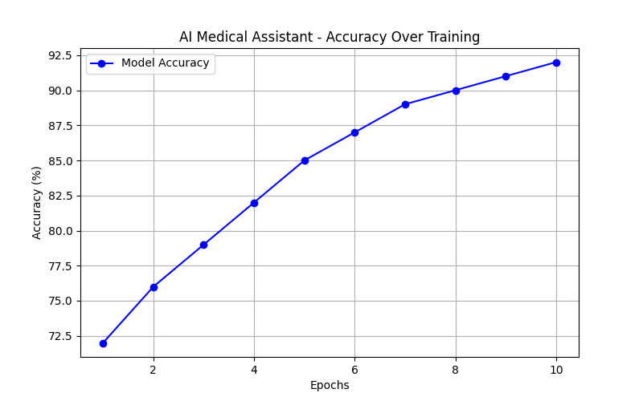

# 🚀 AI Medical Assistance v1

This guide provides step-by-step instructions to set up your project environment, including the installation of FFmpeg and PortAudio across macOS, Linux, and Windows, as well as setting up a Python virtual environment using Pipenv, pip, or conda.

---

## 📜 Table of Contents

1. [🛠 Installing FFmpeg and PortAudio](#installing-ffmpeg-and-portaudio)
   - [🍏 macOS](#macos)
   - [🐧 Linux](#linux)
   - [🪟 Windows](#windows)
2. [🐍 Setting Up a Python Virtual Environment](#setting-up-a-python-virtual-environment)
   - [🔹 Using Pipenv](#using-pipenv)
   - [🔹 Using pip and venv](#using-pip-and-venv)
   - [🔹 Using Conda](#using-conda)
3. [📽️ Pictures & Demo Videos](#pictures--demo-videos)
4. [▶️ Running the Application](#running-the-application)
5. [📌 Project Phases](#project-phases)

---

## 🛠 Installing FFmpeg and PortAudio

### 🍏 macOS

1. **Install Homebrew** (if not already installed):
   ```bash
   /bin/bash -c "$(curl -fsSL https://raw.githubusercontent.com/Homebrew/install/HEAD/install.sh)"
   ```
2. **Install FFmpeg and PortAudio:**
   ```bash
   brew install ffmpeg portaudio
   ```

### 🐧 Linux (Ubuntu/Debian)

1. **Update the package list:**
   ```bash
   sudo apt update
   ```
2. **Install FFmpeg and PortAudio:**
   ```bash
   sudo apt install ffmpeg portaudio19-dev
   ```

### 🪟 Windows

1. **Download FFmpeg**: [FFmpeg Downloads](https://ffmpeg.org/download.html)
2. **Download PortAudio**: [PortAudio Downloads](http://www.portaudio.com/download.html)
3. **Add FFmpeg to System PATH:**
   - Extract the ZIP file to `C:\ffmpeg`
   - Add `C:\ffmpeg\bin` to your environment variables

---

## 🐍 Setting Up a Python Virtual Environment

### 🔹 Using Pipenv
```bash
pip install pipenv
pipenv install
pipenv shell
```

### 🔹 Using pip and venv
```bash
python -m venv venv
source venv/bin/activate   # macOS/Linux
venv\Scripts\activate     # Windows
pip install -r requirements.txt
```

### 🔹 Using Conda
```bash
conda create --name myenv python=3.11
conda activate myenv
pip install -r requirements.txt
```

---

## 📽️ Pictures & Demo Videos

### 🖼 Screenshots
<div style="display: flex; gap: 10px;">
    
    
   
</div>

### 🎥 Demo Video
<a href="https://drive.google.com/file/d/1mj-PPXVoB7rFkZY0TrEMAi0l6N3ncYbT/view?usp=sharing">
  📽️ Demo Video >>>>
   
</a>


---

## ▶️ Running the Application

```bash
python brain_of_the_doctor.py  # Phase 1
python voice_of_the_patient.py  # Phase 2
python voice_of_the_doctor.py  # Phase 3
python gradio_app.py           # Phase 4 (Gradio UI Setup)
```

---

## 📌 Project Phases

### 🏥 Phase 1: Brain of the Doctor
```bash
python brain_of_the_doctor.py
```

### 🎙 Phase 2: Voice of the Patient
```bash
python voice_of_the_patient.py
```

### 🎙 Phase 3: Voice of the Doctor
```bash
python voice_of_the_doctor.py
```

### 💻 Phase 4: Gradio UI Setup
```bash
python gradio_app.py
```

---

### 📩 Feel free to contribute, report issues, or suggest improvements! 🚀
